  <!-- Hero Section -->
  <picture>
    <source media="(prefers-color-scheme: dark)" srcset="assets/aurora-dark.svg">
    <source media="(prefers-color-scheme: light)" srcset="assets/aurora-light.svg">
    
  </picture>

   
  
  <i>somewhere between making things and wondering what to make next.</i>

     

  <!-- Tech Stack -->
  <h3>⚒️ Technologies & Tools</h3>
   
  

     

  <!-- GitHub Activity -->
  <h3>🐍 Contributions</h3>
  
<i>contributions, but make them wander.</i>

  
  <picture>
    <source media="(prefers-color-scheme: dark)" srcset="https://raw.githubusercontent.com/Saee25/Saee25/output/github-snake-dark.svg">
    <source media="(prefers-color-scheme: light)" srcset="https://raw.githubusercontent.com/Saee25/Saee25/output/github-snake.svg">
    
  </picture>

     

  <!-- Projects Section -->
  <h3>✨ Things I've been making</h3>
  
  
  
   
  
  

    
  
  <h3>📈 GitHub Stats</h3>
  

    
  <i>✦</i>

